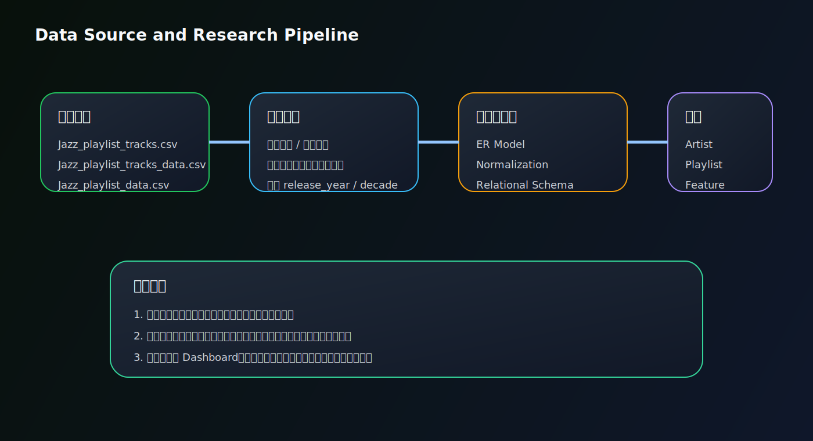
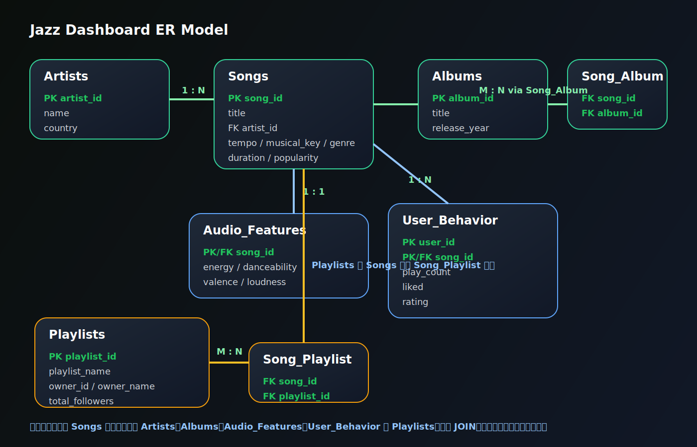
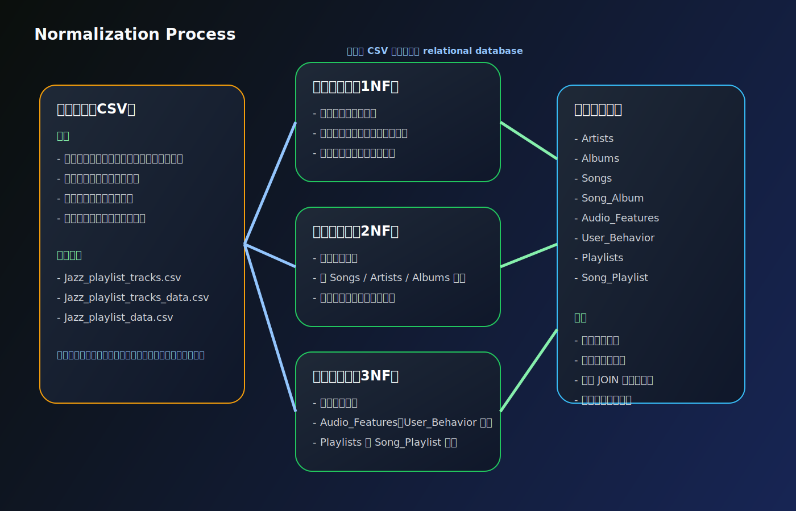
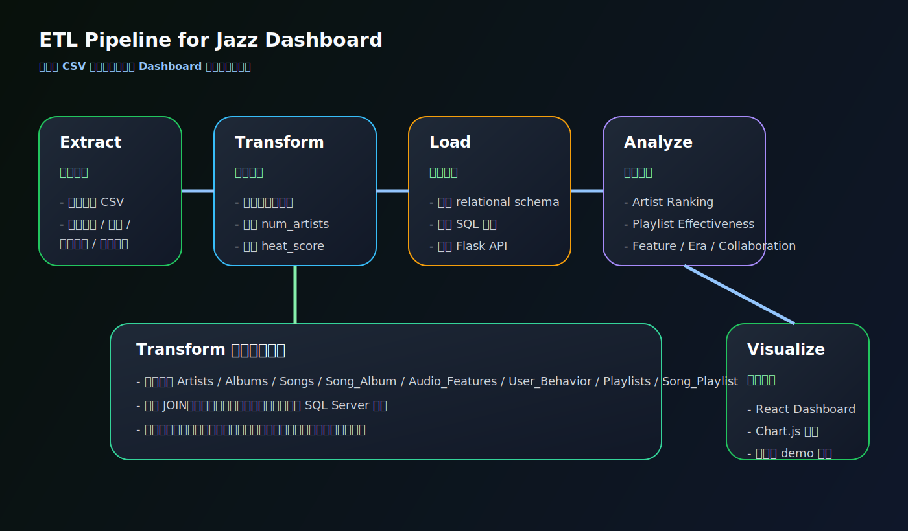
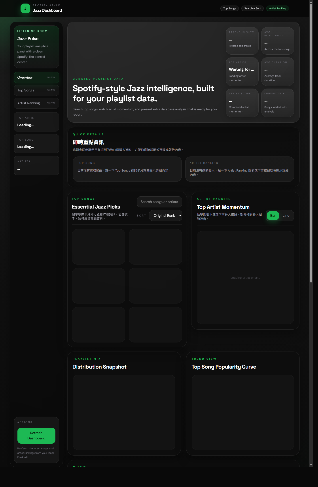

# Jazz Dashboard 資料庫期末專題

這個專題以爵士樂資料集為核心，將原始歌單與歌曲特徵資料整理成正規化的關聯式資料庫，並透過 React Dashboard 將分析結果視覺化，目標是從資料中萃取出具有解釋力的音樂洞察，而不只是單純呈現圖表。

## 目錄

1. 案例背景
2. 研究動機
3. 資料來源
4. 資料庫設計
5. ER Model
6. 資料庫正規化
7. ETL Pipeline
8. 資料庫資料與分析目標
9. 重要 SQL 查詢
10. 系統展示
11. 分析結果摘要
12. 專案執行方式

## 1. 案例背景

近年串流音樂平台累積了大量歌曲、藝人、播放清單與音樂特徵資料。爵士樂雖然不像流行音樂那樣高度商業化，但在不同年代、不同藝人與不同播放清單之間，仍然存在可分析的結構與規律。本專題以爵士歌單資料為基礎，嘗試透過資料庫設計與分析流程回答以下問題：

- 哪些歌曲是資料集中的代表作品
- 哪些藝人最具整體影響力
- 哪些播放清單最容易聚集高表現歌曲
- 音樂特徵和熱門度之間是否存在關聯
- 不同年代的爵士是否呈現不同風格變化
- 是否可以根據歌曲特徵建立簡單推薦系統

## 2. 研究動機

本專題的重點不是只做一個前端畫面，而是希望從資料庫的角度，把原始音樂資料轉換成可查詢、可關聯、可聚合、可分析的 relational structure，並進一步整理成可展示的資料分析專題。

本研究的核心動機包括：

1. 將原始 CSV 音樂資料轉換成有邏輯的關聯式資料庫
2. 以 ER Model 與正規化降低重複資料與更新異常
3. 透過 SQL 查詢與統計分析萃取出可解釋的結果
4. 以 Dashboard 呈現研究結果，作為報告與展示工具

## 3. 資料來源

本專題使用的原始資料主要來自三份 CSV 檔案：

- `Jazz_playlist_tracks.csv`
- `Jazz_playlist_tracks_data.csv`
- `Jazz_playlist_data.csv`

這些資料包含：

- 歌曲名稱、藝人、專輯資訊
- 播放清單名稱與追蹤數
- 音樂特徵，例如 tempo、energy、danceability、valence、loudness
- 熱門度與延伸分析欄位

### 資料來源與研究流程圖



## 4. 資料庫設計

為了支援查詢、關聯分析與未來延伸，本專題將資料拆解為以下關聯式資料表：

- `Artists(artist_id, name, country)`
- `Albums(album_id, title, release_year)`
- `Songs(song_id, title, artist_id, tempo, musical_key, genre, duration, popularity)`
- `Song_Album(song_id, album_id)`
- `Audio_Features(song_id, energy, danceability, valence, loudness)`
- `User_Behavior(user_id, song_id, play_count, liked, rating)`
- `Playlists(playlist_id, playlist_name, owner_id, owner_name, total_followers)`
- `Song_Playlist(song_id, playlist_id)`

這樣的設計可以支援：

- `JOIN` 跨表查詢
- 藝人、歌曲、播放清單聚合分析
- 音樂特徵關聯分析
- 推薦系統相似度比對
- 後續功能擴充與維護

## 5. ER Model

下圖呈現本專題的 ER Model，`Songs` 為核心資料表，連結 `Artists`、`Albums`、`Audio_Features`、`User_Behavior` 與 `Playlists`，並透過關聯表處理多對多關係。



### ER Model 說明

- `Artists` 與 `Songs` 為一對多關係
- `Songs` 與 `Albums` 透過 `Song_Album` 建立多對多關係
- `Songs` 與 `Audio_Features` 為一對一關係
- `Songs` 與 `User_Behavior` 為一對多關係
- `Songs` 與 `Playlists` 透過 `Song_Playlist` 建立多對多關係

## 5.1 Relational Schema 說明

除了 ER Model 之外，本專題也以更接近資料庫實作的 schema 方式整理資料表結構。這樣做的目的，是讓評審不只看到概念關係，也能直接理解實際建表時的主鍵、外鍵與資料拆分邏輯。

### Schema 表示法

- `Artists(artist_id PK, name, country)`
- `Albums(album_id PK, title, release_year)`
- `Songs(song_id PK, artist_id FK, title, tempo, musical_key, genre, duration, popularity)`
- `Song_Album(song_id PK/FK, album_id PK/FK)`
- `Audio_Features(song_id PK/FK, energy, danceability, valence, loudness)`
- `User_Behavior(user_id PK, song_id PK/FK, play_count, liked, rating)`
- `Playlists(playlist_id PK, playlist_name, owner_id, owner_name, total_followers)`
- `Song_Playlist(song_id PK/FK, playlist_id PK/FK)`

### 為什麼要這樣拆表

1. `Artists`、`Albums`、`Songs` 分開  
   若把歌曲、藝人、專輯資訊全部放在同一張表，會造成藝人名稱與專輯資訊在每首歌中反覆重複，不利維護，也容易造成更新異常。

2. 用 `Song_Album` 與 `Song_Playlist` 處理多對多關係  
   一首歌可能出現在不同專輯版本或多個播放清單中，因此不能把這些關係硬塞在單一欄位，而應該使用 junction table 來保持資料一致性。

3. 將 `Audio_Features` 獨立  
   音樂特徵主要用於分析與推薦系統，拆出來後可以把歌曲主資料和分析特徵分離，讓查詢更清楚，也更方便做 correlation 與 similarity 計算。

4. 將 `User_Behavior` 獨立  
   播放數、喜歡與評分屬於互動資料，與歌曲主資料性質不同。分表後可以獨立做 Heat Score、偏好分析與未來個人化推薦。

5. 將 `Playlists` 獨立  
   播放清單本身具有名稱、擁有者與追蹤數等資訊，拆成獨立資料表後，能更自然地做 playlist effectiveness 分析。

### 這樣拆表的好處

- 降低資料重複
- 避免插入、更新、刪除異常
- 更容易進行 JOIN 與聚合分析
- 更適合做推薦系統與分析擴充
- 更符合資料庫課程對 schema 設計與正規化的要求

## 6. 資料庫正規化

本專題以正規化方式逐步整理原始資料，使資料表更適合維護與分析。



### 第一正規化（1NF）

- 將每個欄位保持為原子值
- 避免在同一欄位中混合多個資訊
- 把歌曲、藝人、播放清單等資訊拆成可辨識欄位

### 第二正規化（2NF）

- 移除部分相依
- 將 `Songs`、`Artists`、`Albums` 拆成不同主題表
- 多對多關係改以 `Song_Album`、`Song_Playlist` 管理

### 第三正規化（3NF）

- 移除遞移相依
- 將音樂特徵拆到 `Audio_Features`
- 將使用者互動拆到 `User_Behavior`
- 將播放清單主資料獨立為 `Playlists`

### 正規化效益

- 降低重複資料
- 提高資料一致性
- 減少更新異常
- 更容易進行 JOIN、聚合與分析
- 更適合作為推薦系統與分析應用的基礎

## 7. ETL Pipeline

除了資料表設計之外，本專題也可以從 ETL 的角度來理解整體流程。也就是說，系統不是直接拿原始資料畫圖，而是先經過資料抽取、清理轉換、載入與分析，最後才呈現為 dashboard。



### ETL 的整體流程

```text
Extract -> Transform -> Load -> Analyze -> Visualize
```

### Extract

在資料抽取階段，系統從三份原始 CSV 讀取資料：

- `Jazz_playlist_tracks.csv`
- `Jazz_playlist_tracks_data.csv`
- `Jazz_playlist_data.csv`

這些資料提供了：

- 歌曲名稱與藝人資訊
- 專輯與播放清單資訊
- 音樂特徵欄位
- 熱門度與後續分析基礎欄位

### Transform

在資料轉換階段，系統會進行以下處理：

1. 欄位清理與型別轉換  
   例如把數值欄位整理成可以計算的格式，並補齊分析用欄位。

2. 對齊歌曲、藝人、專輯與播放清單資料  
   將原始資料中重複或混合的資訊重新對應到正規化資料表。

3. 建立衍生欄位  
   包括：
   - `release_year`
   - `decade`
   - `num_artists`
   - `heat_score`

4. 拆分音樂特徵與使用者行為資料  
   將 `Audio_Features` 與 `User_Behavior` 分開，方便後續分析與推薦。

5. 建立推薦系統所需特徵  
   將 `tempo`、`energy`、`danceability`、`valence`、`popularity` 等欄位整理成 similarity 分析可用的特徵集合。

### Load

在資料載入階段，整理後的資料會：

- 載入到 relational schema
- 匯出成 SQL Server 匯入腳本
- 由 Flask API 提供查詢端點
- 在 SQL Server 不可用時以 CSV fallback 維持系統可運作

### Analyze

載入完成後，系統進一步進行資料分析，包括：

- Top Songs 分析
- Artist Ranking
- Playlist Effectiveness
- Audio Feature Analysis
- Era Analysis
- Collaboration Analysis
- Recommendation Mapping

### Visualize

最後，分析結果透過 React + Chart.js 呈現在 Jazz Dashboard 中，讓結果可以直接用於：

- 課堂展示
- 報告撰寫
- 資料庫專題說明
- 互動式 demo

### 為什麼 ETL 對這個專題重要

加入 ETL Pipeline 的說明，可以更清楚展示這個專題不是只有前端介面，而是完整包含：

- 原始資料抽取
- 資料清理與轉換
- 正規化與關聯建模
- 載入資料庫
- 分析與視覺化

這樣能讓評審更容易理解整個系統的工程流程，也能強化資料庫與資料分析的完整度。

## 8. 資料庫資料與分析目標

這個專題最重要的部分，是從資料庫中萃取出「有意義的研究結果」。因此本專題設計了以下幾類分析目標。

### 8.1 熱門歌曲分析

希望回答：

- 哪些歌曲是資料集中的代表作品
- 熱門歌曲的共同特徵是什麼
- 前 10 首與前 20 首歌曲的平均熱門度是否不同

### 8.2 藝人影響力分析

希望回答：

- 哪些藝人在資料集中最具影響力
- 高表現藝人是來自單曲爆紅，還是多首歌曲累積
- 綜合播放數、熱門度與評分後，誰的 `Heat Score` 最高

本專題使用的概念公式如下：

```text
Heat Score = 0.5 * normalized_play_count + 0.3 * popularity + 0.2 * normalized_rating
```

### 8.3 播放清單效果分析

希望回答：

- 哪些播放清單平均熱門度最高
- 哪些播放清單聚集最多高表現歌曲
- 播放清單對歌曲曝光效果是否有影響

### 8.4 音樂特徵分析

希望回答：

- `tempo` 與 `popularity` 是否相關
- `energy` 與 `danceability` 是否有明顯關聯
- `valence` 是否反映資料集整體情緒分布
- 各音樂特徵彼此之間是否存在正相關或負相關

### 8.5 年代分析

希望回答：

- 不同年代爵士歌曲的節奏與風格是否改變
- 早期爵士和現代爵士在 `tempo`、`energy`、`popularity` 上有何差異
- 是否能整理出具有敘述性的音樂演變趨勢

### 8.6 合作模式分析

希望回答：

- 單人演唱與多人合作哪一種表現更好
- 合作人數增加是否真的會提升熱門度
- 合作歌曲是否在平均 Heat Score 上更具優勢

### 8.7 推薦系統分析

希望回答：

- 是否可以利用歌曲特徵找到相似作品
- 推薦結果是否能反映音樂特徵的接近程度
- 推薦系統是否能作為資料分析的延伸應用

## 9. 重要 SQL 查詢

以下查詢是本專題中最能代表資料庫分析價值的 SQL 範例。它們不只是資料抓取工具，也直接對應到 dashboard 的核心圖表與報告結論。

### 9.1 Top Songs 查詢

用途：找出目前資料集中熱門度最高的代表歌曲，並同時帶出藝人資訊。

```sql
SELECT TOP 20
    s.song_id,
    s.title,
    a.name AS artist_name,
    s.popularity,
    s.duration
FROM Songs s
JOIN Artists a ON s.artist_id = a.artist_id
ORDER BY s.popularity DESC, s.title ASC;
```

這個查詢對應前端的 `Top Songs` 區塊，也是使用者最直覺看到的排行榜分析。

### 9.2 Artist Heat Score 查詢

用途：綜合播放數、熱門度與評分，計算藝人的整體影響力。

```sql
WITH artist_base AS (
    SELECT
        a.artist_id,
        a.name AS artist_name,
        AVG(CAST(s.popularity AS FLOAT)) AS avg_popularity,
        AVG(CAST(ub.play_count AS FLOAT)) AS avg_play_count,
        AVG(CAST(ub.rating AS FLOAT)) AS avg_rating
    FROM Artists a
    JOIN Songs s ON a.artist_id = s.artist_id
    LEFT JOIN User_Behavior ub ON s.song_id = ub.song_id
    GROUP BY a.artist_id, a.name
),
artist_norm AS (
    SELECT
        artist_id,
        artist_name,
        avg_popularity,
        avg_play_count,
        avg_rating,
        avg_play_count / NULLIF(MAX(avg_play_count) OVER (), 0) AS normalized_play_count,
        avg_rating / NULLIF(MAX(avg_rating) OVER (), 0) AS normalized_rating
    FROM artist_base
)
SELECT
    artist_name,
    ROUND(
        0.5 * normalized_play_count +
        0.3 * (avg_popularity / 100.0) +
        0.2 * normalized_rating,
        4
    ) AS heat_score
FROM artist_norm
ORDER BY heat_score DESC;
```

這個查詢是 `Artist Ranking` 與 Heat Score 分析的核心，也能清楚展示 SQL 的聚合與 window function 應用。

### 9.3 Playlist Effectiveness 查詢

用途：比較不同播放清單的歌曲數量、平均熱門度與平均 Heat Score。

```sql
WITH song_heat AS (
    SELECT
        s.song_id,
        0.5 * (CAST(ISNULL(ub.play_count, 0) AS FLOAT) / NULLIF(MAX(CAST(ISNULL(ub.play_count, 0) AS FLOAT)) OVER (), 0)) +
        0.3 * (CAST(s.popularity AS FLOAT) / 100.0) +
        0.2 * (CAST(ISNULL(ub.rating, 0) AS FLOAT) / NULLIF(MAX(CAST(ISNULL(ub.rating, 0) AS FLOAT)) OVER (), 0)) AS heat_score
    FROM Songs s
    LEFT JOIN User_Behavior ub ON s.song_id = ub.song_id
)
SELECT
    p.playlist_name,
    COUNT(sp.song_id) AS total_songs,
    AVG(CAST(s.popularity AS FLOAT)) AS avg_popularity,
    AVG(sh.heat_score) AS avg_heat_score
FROM Playlists p
JOIN Song_Playlist sp ON p.playlist_id = sp.playlist_id
JOIN Songs s ON sp.song_id = s.song_id
LEFT JOIN song_heat sh ON s.song_id = sh.song_id
GROUP BY p.playlist_name
ORDER BY avg_heat_score DESC, avg_popularity DESC;
```

這個查詢對應播放清單效果分析，可以拿來說明哪些 playlist 更能聚集高表現歌曲。

### 9.4 Era Analysis 查詢

用途：觀察不同年代爵士歌曲在 tempo 與 popularity 上的差異。

```sql
SELECT
    CONCAT((al.release_year / 10) * 10, 's') AS decade,
    AVG(CAST(s.tempo AS FLOAT)) AS avg_tempo,
    AVG(CAST(s.popularity AS FLOAT)) AS avg_popularity,
    COUNT(*) AS song_count
FROM Songs s
JOIN Song_Album sa ON s.song_id = sa.song_id
JOIN Albums al ON sa.album_id = al.album_id
WHERE al.release_year IS NOT NULL
GROUP BY (al.release_year / 10)
ORDER BY (al.release_year / 10);
```

這個查詢能讓報告不只停留在排行榜，而是延伸到音樂風格在不同年代的變化。

### 9.5 Collaboration Analysis 查詢

用途：分析多人合作是否與歌曲表現有關。

```sql
SELECT
    num_artists,
    AVG(CAST(popularity AS FLOAT)) AS avg_popularity,
    COUNT(*) AS song_count
FROM Songs
GROUP BY num_artists
ORDER BY num_artists;
```

這個查詢能對應合作分析圖表，用來回答「合作人數增加是否真的提升表現」。

### 9.6 Valence Distribution 查詢

用途：把歌曲依情緒指標分群，觀察資料集整體的情緒分布。

```sql
SELECT
    CASE
        WHEN af.valence >= 0.66 THEN '高情緒'
        WHEN af.valence >= 0.33 THEN '中性情緒'
        ELSE '低情緒'
    END AS valence_bucket,
    COUNT(*) AS song_count
FROM Audio_Features af
GROUP BY
    CASE
        WHEN af.valence >= 0.66 THEN '高情緒'
        WHEN af.valence >= 0.33 THEN '中性情緒'
        ELSE '低情緒'
    END
ORDER BY song_count DESC;
```

這個查詢是情緒圓餅圖的基礎，也能幫助說明爵士資料集偏向抒情或中低情緒區間。

## 10. 系統展示

本專題將資料分析結果整合為 Spotify 風格的 Jazz Dashboard，主要功能包括：

- `Top Songs` 熱門歌曲列表
- `Artist Ranking` 藝人排行榜
- `Heat Score` 分析圖表
- `Tempo vs Popularity` 散點圖
- `Energy vs Danceability` 散點圖
- `Valence` 情緒分布圓餅圖
- `Correlation Matrix`
- `Era Analysis` 年代分析
- `Collaboration Analysis` 合作分析
- `You may also like` 推薦功能
- `Relational 設計成果` 與資料庫結構展示

### 系統畫面



## 11. 分析結果摘要

根據目前資料庫整理與系統分析，已可觀察到以下趨勢：

### 熱門歌曲

代表性歌曲包含：

- `Don't Know Why`
- `Come Away With Me`
- `By Your Side`
- `What a Wonderful World`
- `It Runs Through Me`

### 藝人影響力

目前 Heat Score 較高的藝人包含：

- `Sade`
- `Tom Misch`
- `Erick the Architect`

### 播放清單效果

表現較好的播放清單包含：

- `Easy Jazz`
- `Jazz Vibes`
- `Jazz for Sleep`
- `Jazz Rap`

### 情緒分布

資料中的歌曲主要集中在：

- `低情緒`
- `中性情緒`

顯示爵士資料集中，多數歌曲偏抒情、柔和或中度情緒張力。

### 合作分析

目前結果顯示：

- 單人歌曲數量最多
- 雙人合作的平均表現略高於單人歌曲
- 合作人數增加並不一定帶來更高熱門度

## 12. 專案執行方式

### 前端

```powershell
cd frontend
npm install
npm run dev
```

### 後端

```powershell
py -3 SQL.py
```

### SQL Server 匯入方式

若要在 SSMS 中建立完整資料庫，可使用以下腳本：

- `JazzDB_schema.sql`
- `JazzDB_seed.sql`
- `JazzDB_full_import.sql`

建議流程：

1. 先執行 `JazzDB_schema.sql`
2. 再執行 `JazzDB_seed.sql`
3. 或直接執行 `JazzDB_full_import.sql`

## 專案結構

```text
frontend/
  public/
  src/
    components/
    hooks/
    utils/
SQL.py
JazzDB_schema.sql
JazzDB_seed.sql
JazzDB_full_import.sql
generate_jazzdb_sql.py
docs/
  data-source.svg
  er-model.svg
  normalization.svg
README.md
```

## 使用技術

### 前端
- React
- Vite
- Chart.js
- CSS / Utility class styling

### 後端
- Flask
- Flask-CORS
- pandas
- numpy
- pyodbc

### 資料處理與資料庫
- SQL Server
- CSV preprocessing
- Relational schema design
- Normalization
- Aggregation analysis
- Similarity-based recommendation

## 專案價值

這個專題的價值不只是完成一個視覺化頁面，而是將資料庫設計、正規化、分析邏輯與前端展示整合成一個完整作品。透過這個流程，可以清楚展示：

- 如何從原始資料建立 relational database
- 如何用資料庫思維規劃 ER Model 與正規化
- 如何從資料中萃取研究問題與分析目標
- 如何把分析結果轉成可展示的 Dashboard 與報告內容
